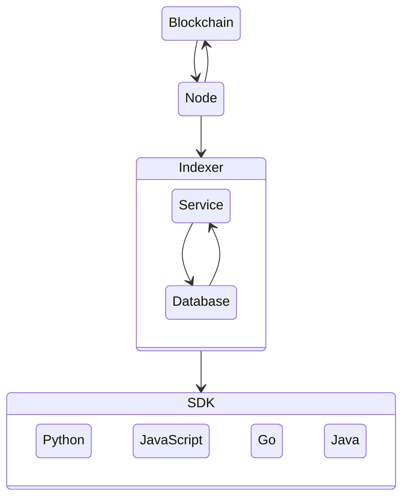

  
  

---

    
    <h1 align="left">Algorand Indexer</h1>
    <h3 align="left">Block Foundation Docker Containers</h3>

---

    

The primary purpose of this Indexer is to provide a REST API interface of API calls to support searching the Algorand Blockchain. The Indexer REST APIs retrieve the blockchain data from a PostgreSQL compatible database that must be populated. This database is populated using the same indexer instance or a separate instance of the indexer which must connect to the algod process of a running Algorand node to read block data. This node must also be an Archival node to make searching the entire blockchain possible.

## Introduction

Welcome to the Block Foundation's Algorand Indexer Docker Image Repository, a crucial resource in our mission to foster a more accessible and efficient Algorand network experience.

We believe that in order to fully reshape architecture and real-estate with blockchain technology, we must facilitate easy and reliable access to blockchain resources. As such, this repository provides you with a Docker image specifically designed for running the Algorand Indexer.

In the context of the Algorand blockchain network, an Indexer is a tool that reads data from the Algorand blockchain and maintains a database of transactions and accounts that are searchable and indexed. On the other hand, Docker is a widely-used platform that simplifies the deployment, scaling, and management of applications. By merging these two technologies, we provide an easy-to-use and scalable way to interact with the Algorand network.

Our Docker image for the Algorand Indexer has been meticulously designed for accessibility, dependability, and security. It provides a preconfigured environment that's ready for use, thus reducing the hassle of manual setup. It is an ideal resource for developers keen on exploring the Algorand network, as well as those looking to contribute to the network by running an indexer.

Within this repository, you'll find comprehensive instructions on how to use the Docker image, alongside the source code of the image itself. We warmly encourage our community to utilize this Docker image, provide feedback, and join us in continually enhancing this resource.

As with all our projects, this Docker image stands as a testament to our commitment to transparency, collaboration, and democratization of technology. We are thrilled to share this resource with you and can't wait to see how it supports your endeavours in the blockchain space.

Thank you for being a part of the Block Foundation Community, and joining us on this exciting journey to transform the architecture and real-estate sector through the power of blockchain technology. Together, we'll build a future that's sustainable, equitable, and innovative.

## Network

## Resources

### Algorand

- [Algorand](https://www.algorand.com/)
- [Algorand | Developer](https://developer.algorand.org/)

#### Algorand SDK

- [Algorand SDK | Docs](https://py-algorand-sdk.readthedocs.io/en/latest/)
- [Algorand SDK | GitHub](https://github.com/algorand/py-algorand-sdk/)

#### Algorand Go

- [Algorand Go | GitHub](https://github.com/algorand/go-algorand)

#### AlgoDjango
- [AlgoDjango | Tutorial](https://developer.algorand.org/solutions/getting-started-with-python-algorand-sdk-and-django/)
- [AlgoDjango | GitHub](https://github.com/ipaleka/algodjango)

#### Algorand PyTeal

- [Algorand PyTeal](https://github.com/algorand/pyteal)
- [Algorand PyTeal | Utils](https://github.com/algorand/pyteal-utils)
- [Algorand PyTeal | Course](https://github.com/algorand-devrel/pyteal-course)

#### Algorand Sandbox

- [Algorand Sandbox](https://github.com/algorand/sandbox)

## Development

### Authors

This is an open-source project by the **[Block Foundation](https://www.blockfoundation.io "Block Foundation website")**.

The Block Foundation mission is enabling architects to take back initiative and contribute in solving the mismatch in housing through blockchain technology. Therefore the Block Foundation seeks to unschackle the traditional constraints and construct middle ground between rent and the rigidity of traditional mortgages.

website: [www.blockfoundation.io](https://www.blockfoundation.io "Block Foundation website")

### Contributing

We'd love for you to contribute and to make this project even better than it is today!
Please refer to the [contribution guidelines](.github/CONTRIBUTING.md) for information.

## Legal

### Copyright

Copyright &copy; 2023 [Block Foundation](https://www.blockfoundation.io/ "Block Foundation website"). All Rights Reserved.

### License

Except as otherwise noted, the content in this repository is licensed under the
[Creative Commons Attribution 4.0 International (CC BY 4.0) License](https://creativecommons.org/licenses/by/4.0/), and
code samples are licensed under the [MIT License](https://opensource.org/license/mit/).

Also see [LICENSE](https://github.com/block-foundation/community/blob/master/LICENSE) and [LICENSE-CODE](https://github.com/block-foundation/community/blob/master/LICENSE-CODE).

### Disclaimer

**THIS SOFTWARE IS PROVIDED AS IS WITHOUT WARRANTY OF ANY KIND, EITHER EXPRESS OR IMPLIED, INCLUDING ANY IMPLIED WARRANTIES OF FITNESS FOR A PARTICULAR PURPOSE, MERCHANTABILITY, OR NON-INFRINGEMENT.**
