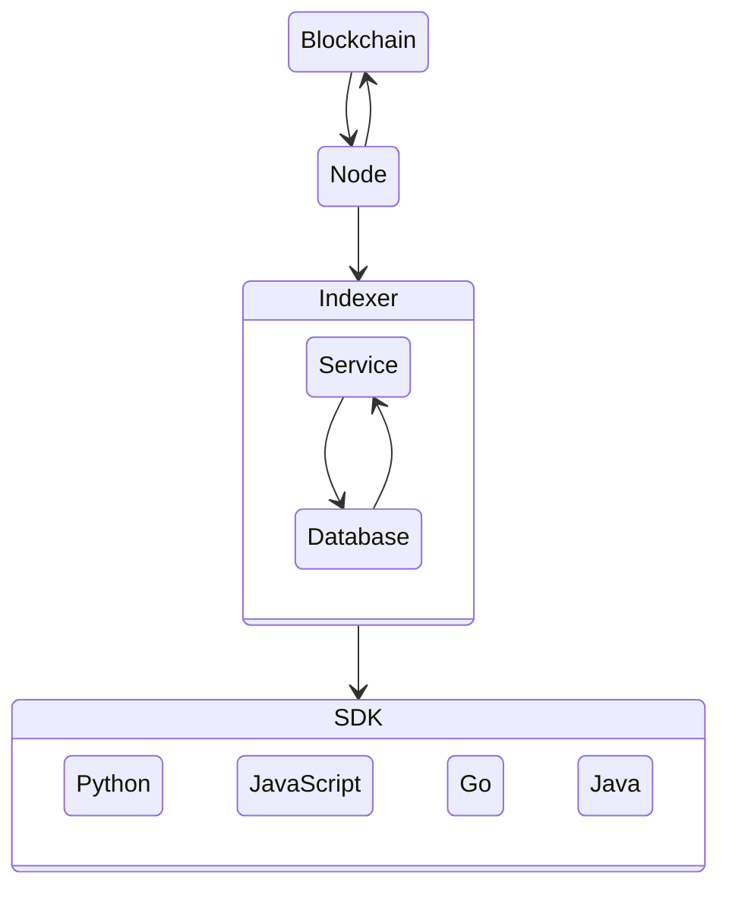

  
  

---

    
    <h1 align="left">Algorand Indexer</h1>
    <h3 align="left">Block Foundation Docker Containers</h3>

---

    

The primary purpose of this Indexer is to provide a REST API interface of API calls to support searching the Algorand Blockchain. The Indexer REST APIs retrieve the blockchain data from a PostgreSQL compatible database that must be populated. This database is populated using the same indexer instance or a separate instance of the indexer which must connect to the algod process of a running Algorand node to read block data. This node must also be an Archival node to make searching the entire blockchain possible.

## Network

## Resources

### Algorand

- [Algorand](https://www.algorand.com/)
- [Algorand | Developer](https://developer.algorand.org/)

#### Algorand SDK

- [Algorand SDK | Docs](https://py-algorand-sdk.readthedocs.io/en/latest/)
- [Algorand SDK | GitHub](https://github.com/algorand/py-algorand-sdk/)

#### Algorand Go

- [Algorand Go | GitHub](https://github.com/algorand/go-algorand)

#### AlgoDjango
- [AlgoDjango | Tutorial](https://developer.algorand.org/solutions/getting-started-with-python-algorand-sdk-and-django/)
- [AlgoDjango | GitHub](https://github.com/ipaleka/algodjango)

#### Algorand PyTeal

- [Algorand PyTeal](https://github.com/algorand/pyteal)
- [Algorand PyTeal | Utils](https://github.com/algorand/pyteal-utils)
- [Algorand PyTeal | Course](https://github.com/algorand-devrel/pyteal-course)

#### Algorand Sandbox

- [Algorand Sandbox](https://github.com/algorand/sandbox)

## Legal

### Disclaimer

**THIS SOFTWARE IS PROVIDED AS IS WITHOUT WARRANTY OF ANY KIND, EITHER EXPRESS OR IMPLIED, INCLUDING ANY IMPLIED WARRANTIES OF FITNESS FOR A PARTICULAR PURPOSE, MERCHANTABILITY, OR NON-INFRINGEMENT.**
